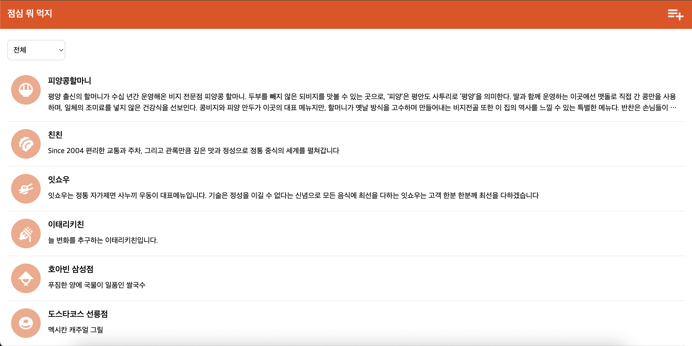
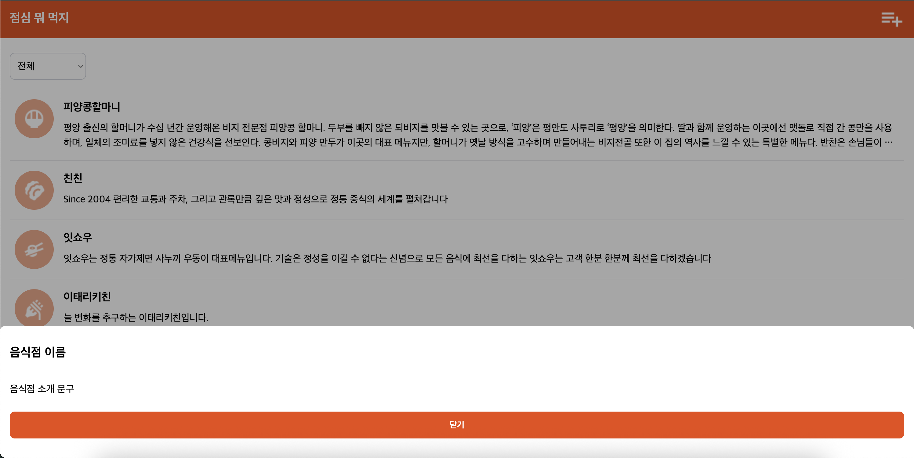
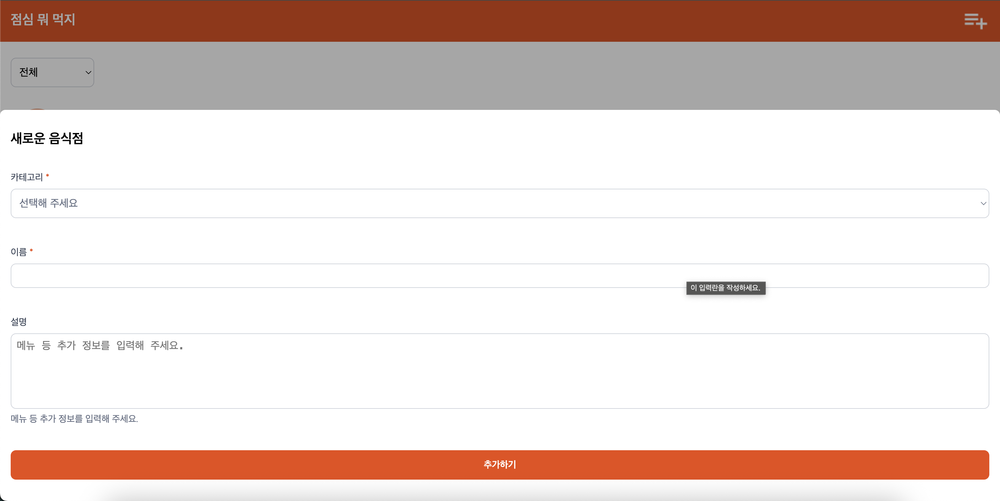

## 필수 구현 내용

`/templates`의 `index.html` 템플릿을 그대로 `App.jsx`로 구현하기

1. `index.html`의 기능을 여러 개의 컴포넌트로 분리하기
2. 스타일: 별도의 css파일로 분리해서 각 컴포넌트에서 import

- 가능하다면 `module.css` 사용해볼 것

## 구체적인 내용

### 컴포넌트 구조

```
<App>
  <Header />
  <main>
    <CategoryFilter />
    <RestaurantList />
  </main>
  <aside>
    <RestaurantDetailModal />
    <AddRestaurantModal />
  </aside>
</App>
```

### 파일 변경

1. 컴포넌트 분리
   jsx 문법에 따라 html 파일을 각각 하나의 기능을 하는 독립 컴포넌트로 분리해주었습니다.
2. `style.css` 분리
   각 컴포넌트에서 import하기 위해 컴포넌트 별로 적용되는 스타일을 별도의 css 파일로 분리했습니다.
3. png 파일 이동
   찾아보니 경로를 깔끔하게 만들려면 이미지 파일은 public 폴더에 있는 것이 좋다고 해서 파일 경로를 옮겼습니다.

```
styles/
  global.css
  layout.css
  components/
    Header.css
    CategoryFilter.css
    RestaurantList.css
    Modal.css
    Form.css
```

<분리 기준>

- `styles` 폴더 안에 `components` 폴더를 배치해서 컴포넌트에 `App.jsx`에 사용되는 스타일과 컴포넌트에 사용되는 스타일을 명확히 분리하고자 했습니다.
- 폰트나 컬러 같은 기본 스타일이랑 레이아웃 스타일은 분리하는 것이 직관적일 것 같아서 똑같이 `App.jsx`에 import 하지만 분리해주었습니다.
- `Modal.css`와 `Form.css` 같은 경우도 모달의 레이아웃 스타일과 폼을 컨트롤하는 스타일을 분리해주는 것이 좋을 것 같아서 나누었습니다.

## 구현 사진

  
  


## 디렉토리 구조


## 느낀점

스터디 전에는 JS 기본 문법을 제대로 공부하지 않고 리액트를 일단 시작해서 사실 어떤 원리로 작동하는건지 이해하지 못했었습니다. 하지만 이번 미션을 통해 UI 구성에 맞게 컴포넌트 단위를 고민해보고, HTML을 JSX로 바꿔보는 과정을 거치면서 리액트의 동작 방식을 훨씬 쉽게 이해할 수 있었습니다! 항상 CSS가 어렵다고 생각했었는데, 컴포넌트에 맞춰서 분리하는 작업을 해보니 아직 열심히 공부해야겠지만 두렵던 마음은 사라진 것 같습니다!
