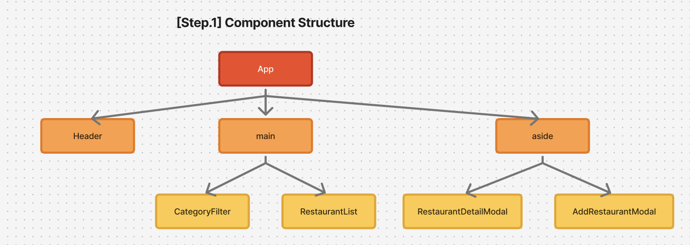

## 필수 구현 내용

1. `RestaurantList`가 `props`로 restaurants 배열을 받아서 그릴 수 있도록 변경
2. 카테고리 필터에 따라 필터된 음식점 목록을 보여줄 수 있도록 변경

## 구체적인 내용

1. `src/data/`에 `restaurants.js` 파일을 만들어 초기 식당 데이터 6개를 저장
2. `App.jsx`에서 `category` 상태로 선택된 카테고리를 보관
3. `category === "전체"`면 전체, 그 외엔 해당 카테고리만 필터
4. props 전달

- `CategoryFilter`: `category`, `onChangeCategory`
- `RestaurantList`: `restaurants`

### 데이터 흐름 요약

1. `App` : `category` 상태 소유
2. `CategoryFilter`에 값(`category`)과 콜백(`onChangeCategory`)을 전달
3. 사용자가 선택 변경
4. 콜백으로 `App`에 알림
5. `App`은 `category` 갱신, `filteredRestaurants` 계산
6. 계산된 `filteredRestaurants`를 `RestaurantList`에 props로 전달
7. `RestaurantList`가 렌더링 (화면에 표현)
   이 때, 데이터는 위에서 아래로 단방향으로만 흐르는 것이 특징이다.

## 구현 영상

## 디렉토리 구조

## 궁금한 점 및 느낀점

- 컴포넌트 디렉토리 구조가 1,2단계 모두 변함이 없다고 생각해서 수정하지 않았는데, 이렇게 하는 것이 맞을까요?
  2단계 미션에서 useState와 props를 사용해보면서 상태를 부모 컴포넌트가 가지고, 자식은 props로 값과 콜백을 주고받는다는 흐름 이해할 수 있었던 것 같습니다. 사실 수정하면서 데이터 흐름이 조금 헷갈려서 제가 생각한 데이터 흐름을 적어보았는데, 확인해주시면 감사하겠습니다!
